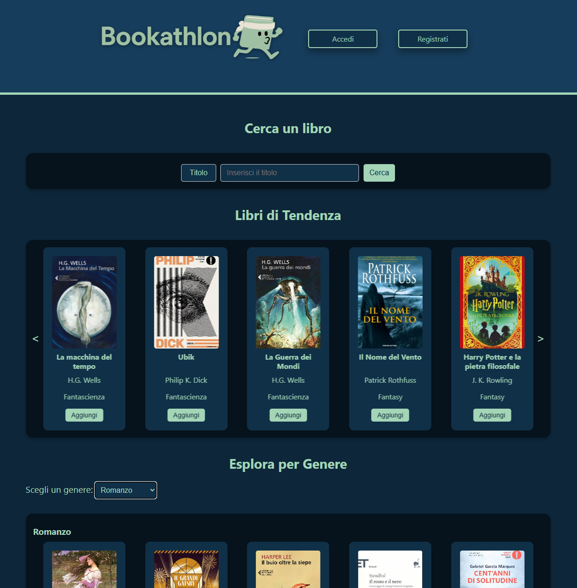
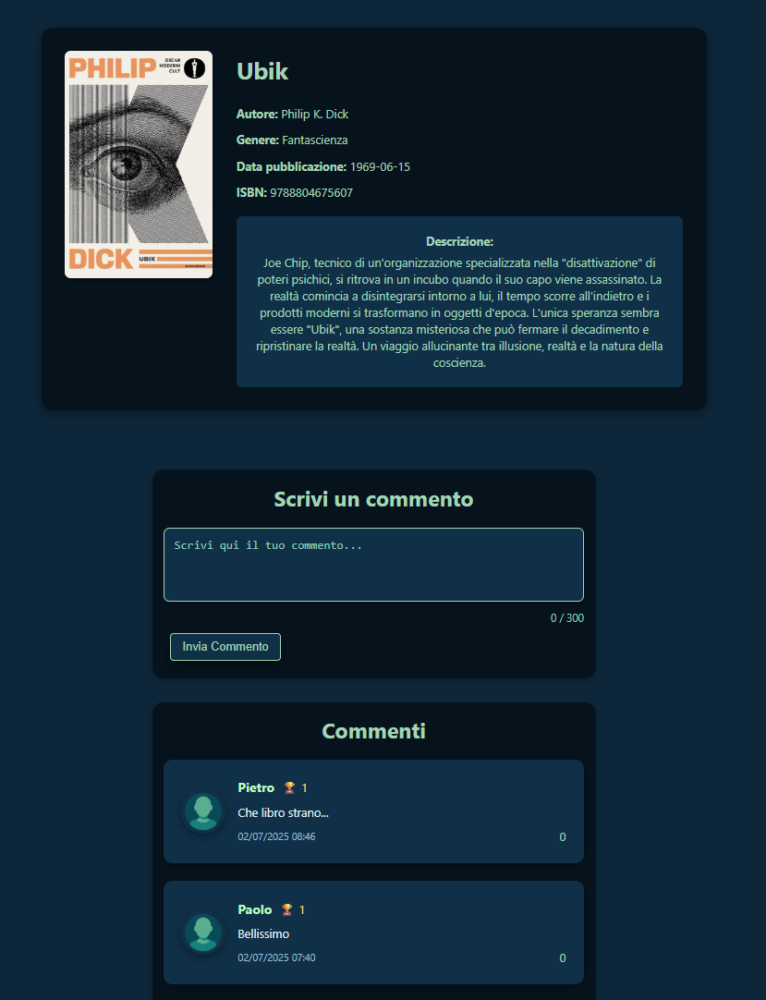
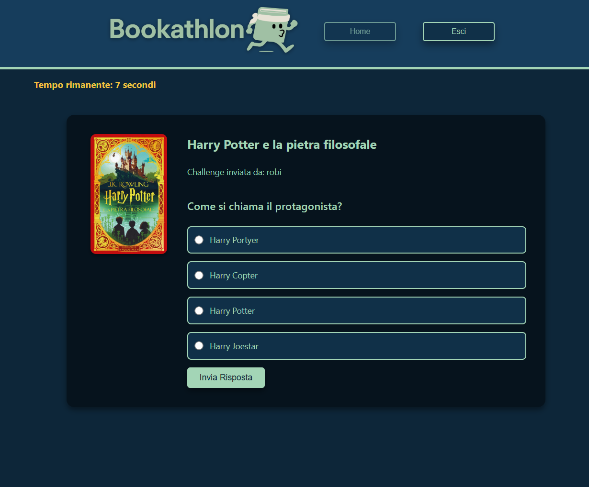

# Rendiamo la Lettura un'Esperienza Condivisa

**Bookathlon** è una piattaforma web interattiva progettata per promuovere la lettura, trasformandola in un'attività sociale, stimolante e moderna. Ogni utente può creare la propria libreria virtuale, interagire con amici lettori e partecipare a sfide per accumulare punti, scalare classifiche e condividere l’amore per i libri.

## Features

- 👤 **Registrazione & Login Sicuro**
  - Registrazione con validazione lato server
  - Login sicuro tramite Spring Security e password cifrate con BCrypt
  - Ruoli differenziati (admin, user)

- 📚 **Libreria Personale**
  - Aggiungi libri come "Letto" o "Da leggere"
  - Inizia la lettura e traccia i progressi
  - Rimuovi libri con un click

- 🧠 **Challenge**
  - Crea sfide quiz basate su libri
  - Invia challenge ad amici lettori
  - Rispondi, guadagna punti, scala la classifica

- 💬 **Commenti & Like**
  - Commenta i libri letti
  - Metti like ai commenti degli altri utenti

- 🏆 **Classifiche**
  - Classifica globale dei lettori più attivi
  - Classifica amici per confronti social

- 🧑‍🤝‍🧑 **Funzionalità Social**
  - Cerca altri lettori per username
  - Invia richieste di amicizia
  - Gestisci le richieste ricevute e inviate

## 📸 Screenshots

<p align="center">
  
</p>

<p align="center">
  
</p>

<p align="center">
  
</p>

## 💻 Tech Stack

| Tecnologia          | Ruolo                                       |
|---------------------|---------------------------------------------|
| **Spring Boot (Java)** | Backend MVC, sicurezza, validazioni      |
| **Thymeleaf**          | Template Engine lato server               |
| **PostgreSQL**         | Database relazionale                      |
| **HTML5 / CSS3**       | Interfaccia utente                        |
| **JavaScript**         | Interattività client-side                 |
| **Glide.js**           | Caroselli dinamici e responsive           |
| **Spring Security**    | Autenticazione & Autorizzazione           |


## 🔒 Sicurezza

- Accesso con credenziali criptate
- Accesso a `/admin/**` riservato agli amministratori
- Protezione CSRF abilitata
- Controllo sessione personalizzato per redirect post-login


## 📐 Design

- Layout responsive mobile-first
- Navbar dinamica con hamburger menu su dispositivi piccoli
- Modal per conferme, dropdown custom per logout e profilo


## Esecuzione & Build

```bash
# Esegui da terminale
./mvnw spring-boot:run

# Oppure builda il JAR
./mvnw clean package
java -jar target/bookathlon-backend-0.0.1-SNAPSHOT.jar
```

Progetto predisposto per:

- Connessione a PostgreSQL su Aiven (database cloud)

- Deploy continuo su Render.com

🚧 In arrivo una versione completamente dockerizzata per l’esecuzione in locale.


## 🧑‍💻 Team

Questo progetto è stato realizzato per **TBR S.p.A.** nell’ambito del corso *Business Intelligence Software Developer* di ITS ICT Piemonte.